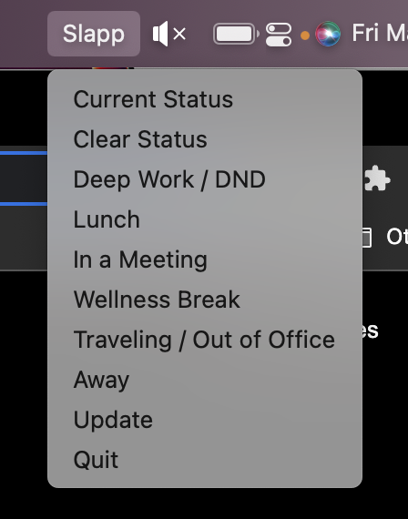

# Slapp

Hello!  Welcome!  I hope you found your way to this page safely.  You are looking at the instruction page for Slapp, which is a Slack app I made so you can customize and change your Slack status from your Mac's menu bar!  Buckle up, because you’re in for a wild ride!

# Installation Instructions

## Creating a Slack app

Before we even take a look at the app itself, it requires a little bit of setup.  First, you need to go to [https://api.slack.com](https://api.slack.com).  After logging in, you’ll see a button to `Create an app` .  Click it.  Select the `from scratch` option.  You can name the app anything you want, but I named it `Slapp` for the sake of consistency.  Choose the workspace you want to install it to, then click `Create App`.

## Token Scopes

Now we need to give our app permissions.  On the left side of the page, navigate to the `Oauth & Permissions` menu.  Scroll down to the `Scopes` section.  The scopes we are adding are specifically `User Token Scopes`, so please don't add `Bot Token Scopes` and then start opening tickets about how this app doesn't work.  Ok, so assuming you have found the `User Token Scopes`, there are four (4) that you need to add.  They are:

1. dnd:write
2. users.profile:read
3. users.profile:write
4. users:write

Now that we’re over that hurdle, scroll up to the `Oath Tokens for your Workspace` section and click `Install to Workspace`.  You will now see a `User Oath Token`.  You need that.  Save it somewhere.  We will be using it shortly.  Don't try to memorize it.

## Installing Slapp!

### Using the "installer"
Finally, we made it.  Are you still here?  Good.  We’re in the home stretch.  Now you just need to download Slapp.  Here it is, in a zip file: [slapp.zip](slapp.zip)

After downloading it, unzip it by double-clicking it.  Drag that resulting file into your `Applications` folder.  Run it.

You will be prompted for your first name.  This is not a trick.  Slack requires your first name so it can communicate with the app.  This was the easiest 300 points on your SAT’s, so you better get this right the first time.  Click “Submit”.  Now it’s going to ask for the API key, which is the `User Oath Token` that we discussed earlier.  Go copy/pasta that puppy in there, and click "Submit”!

### Installing from source
If you want to create/build the "app" yourself, you can run the set `setup.py` file.  If you want to just skip to the meat and potatoes, `slapp.py` is where all the magic is happening.  I'm not going to dig too deep here; if you're doing it this way, there's a good chance that you can just read the code and see what it's doing.  Long story short, it checks to see if you have a config already, and if not, it helps you get one in place.  Really, just use the app.

## The End!… kind of

If you’re happy with what you have now, you can leave it be.  Here is some information about the default options.

1. Current Status - clicking this will let you see your current Slack status and emoji
2. Clear Status - clicking this will clear your current Slack status and emoji, and will resume notifications (if they were paused) and set your presence back to “auto” (if you were “away”).
3. Deep Work / DND - This option is set to expire in 2 hours.
4. Lunch - This option is set to expire in 1 hour.
5. In a Meeting - This option is set to expire in 1 hour.
6. Wellness Break - This option is set to expire in 1 hour.
7. Traveling / Out of Office - This option is set to NOT expire.
8. Update - We’ll get to this in the `Power Users` section.
9. Quit - It closes Slapp :)

### For the Power Users!

I know that this app seems perfect already, and there really isn’t anywhere to go from the peak, but I know the people want more, so I’m giving them more.  Still buckled up?  Because you're about to have your mind blown!

This entire app is configurable.  If you navigate to `~/.slapp`, you will find a `config.json` file.  In there, you will see your first name and API key, along with all of the menu items!  Here are your options and what they do.

1. name (required): This is the text that will show up in the menu for you to select.
2. status_text (required): This text will become your Slack status.
3. status_emoji (required): This will become your Slack emoji.
4. status_expiration(hours)(required): Now this one has a little more meat to it.  This sets the expiration time for your text, emoji, and do_not_disturb (which we will discuss in a moment).  When that time expires, your Slack status will clear, and the do_not_disturb will turn off.
5. do_not_disturb (boolean)(optional): Not to be confused with `away`, this option pauses your notifications and puts the little `z` over your status color when set to `true`.
6. away (boolean)(optional): Setting this to `true` will make you appear as "away" in Slack.  It will NOT automatically clear when the status clears.  If you click “Clear Status" in the Slapp menu, however, it will turn off the "away" status.

### Conclusion
Thanks for checking out Slapp; I hope you find it useful :)